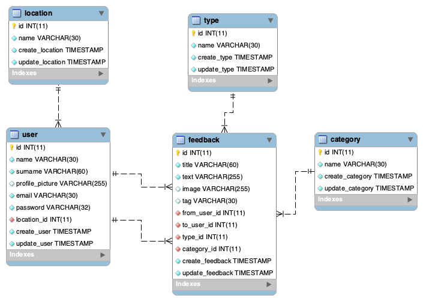

## BD

**hab.sql**

Es la base de datos final exportada, con los create e inserts para importar

## Proceso y consultas

**create_hab.sql**

Es el proceso de creación de las tablas y atributos

**inserts_hab.sql**

Son los datos introducidos de ejemplo

**consultas_hab.sql**

Consultas para probar las relaciones

---

